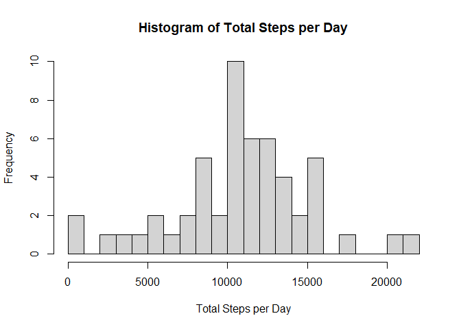
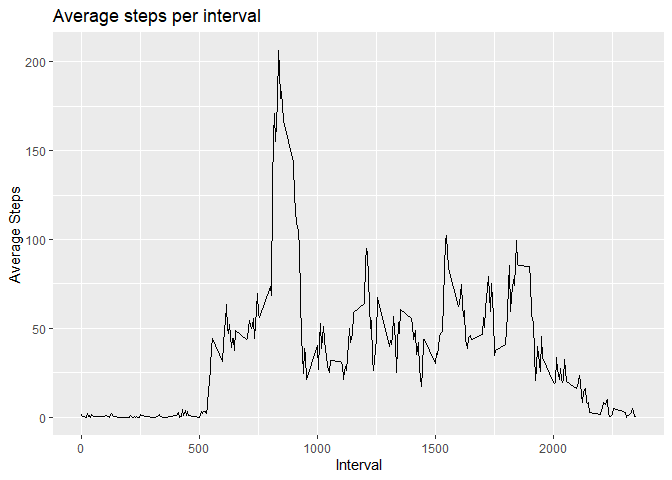
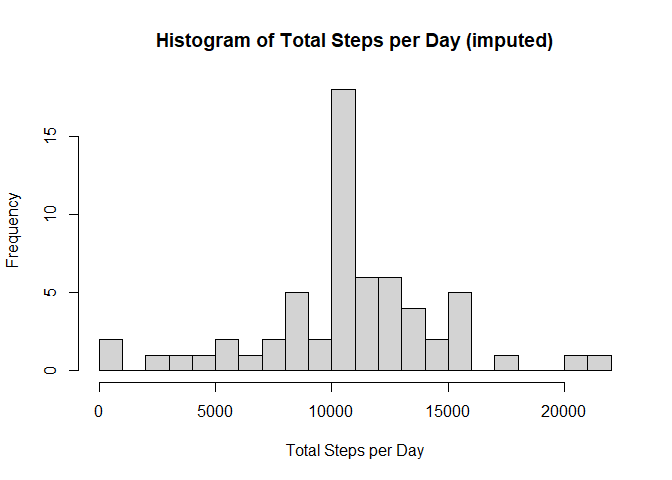
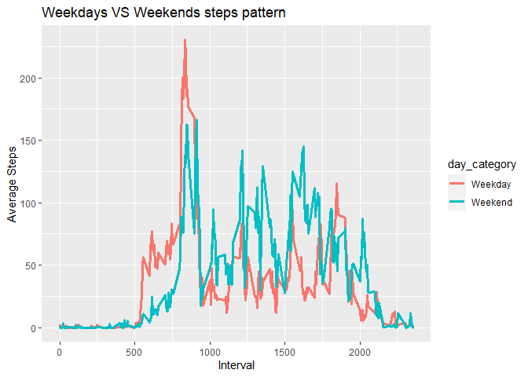
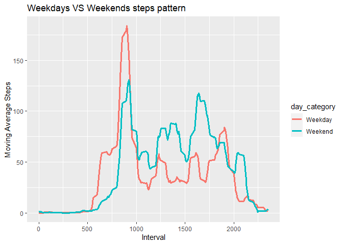

## Importing libraries

```r
library(dplyr)
library(ggplot2)
```
## 1.Loading and preprocessing the data

```r
zip_path <- 'activity.zip'
unzip(zipfile =zip_path)
data <- read.csv('activity.csv')
```
## 2.What is mean total number of steps taken per day?

```r
# Aggregate the total of steps each day
daily_steps <- aggregate(steps ~ date, data = data, FUN = sum)
# Histogram of total steps per days
hist(daily_steps$steps, breaks = 20, 
     xlab = "Total Steps per Day", 
     ylab = "Frequency",
     main = "Histogram of Total Steps per Day")
```

<!-- -->

```r
# Calculate the mean and median
mean_daily <- round(mean(daily_steps$steps),0)
median_daily <- round(median(daily_steps$steps),0)
```
The mean daily steps is 1.0766\times 10^{4} and median daily step is 1.0765\times 10^{4}`

## 3.What is the average daily activity pattern?

```r
# Time series of 5-minutes interval and average number of steps
steps_pattern <- aggregate(steps ~ interval, data = data, FUN = mean)

ggplot(steps_pattern, aes(x= interval, y = steps)) + 
  geom_line() +
  labs(x = "Interval", y = "Average Steps", title = "Average steps per interval")
```

<!-- -->

```r
# 5-minutes interval with maximum number of steps
max_steps <- max(steps_pattern$steps)
max_interval <- steps_pattern$interval[max_steps]
```
The max avg step is 206 at 1705


## 4.Imputing missing values
We first check for columns with missing values
From the result it seem that only the steps column has missing value
Since we already know the average step for each 5-minute interval in a day, so now we can just replace the known average values to each missing value in whichever interval


```r
# Checking the columns for missing values
print(colSums(is.na(data)))
```

```
##    steps     date interval 
##     2304        0        0
```

```r
# Identify all rows with missing value
na_rows <- is.na(data$steps)

# Replacing the missing values with the corresponding mean values from steps_pattern
data$steps[na_rows] <- steps_pattern$steps[match(data$interval[na_rows],
                    steps_pattern$interval)]

# The histogram of the new data
daily_steps_imputed <- aggregate(steps ~ date, data = data, FUN = sum)

# Histogram of total steps per days
hist(daily_steps_imputed$steps, 
     breaks = 20, 
     xlab = "Total Steps per Day", 
     ylab = "Frequency",
     main = "Histogram of Total Steps per Day (imputed)")
```

<!-- -->

```r
# Calculating the new mean and median
mean_imputed <- round(mean(daily_steps_imputed$steps),0)
median_imputed <- round(median(daily_steps_imputed$steps),0)
# Checking for missing values
print(colSums(is.na(data)))
```

```
##    steps     date interval 
##        0        0        0
```
After imputation, there is no longer any NA values
As for the mean and median of daily steps, before it was 1.0766\times 10^{4} and 1.0765\times 10^{4}, after imputation it is 1.0766\times 10^{4} and 1.0766\times 10^{4}

The mean values stayed the same but the median is slightly affect toward the mean value but since the 2 values were already similar to begin with so the effect is minimal

## 5.Are there differences in activity patterns between weekdays and weekends?

```r
# Converting the date col to day of the week
data$date <- as.Date(data$date)
data$dayofweek <- weekdays(data$date)

# Dividing the rows into weekdays and weekend
wkn <- c('Saturday','Sunday')

data_divided <- data %>%
  mutate(day_category = ifelse(weekdays(date) %in% wkn, 'Weekend', 'Weekday'))

# Aggregating the values
steps_pattern <- aggregate(steps ~ interval+ day_category, data = data_divided, FUN = mean)

# Checking pattern on the weekdays and weekend
ggplot() + 
  geom_line(data = steps_pattern, 
            aes(x= interval, y = steps, color = day_category), size = 1.2) +
  labs(x = "Interval", y = "Average Steps", 
       title = "Weekdays VS Weekends steps pattern")
```

<!-- -->

Since the graph was not very clear so we smoothen the line by converting the values to a moving average of 60-minute interval (averaging value of 12 consecutive intervals) 

```r
# Load the necessary library
library(zoo)

# Calculate the moving average for weekdays and weekends separately
steps_pattern$rolling_mean <- rollapply(steps_pattern$steps, width = 12, FUN = mean, align = "right", fill = 0)

# Plotting the moving average for weekdays and weekends
ggplot() + 
  geom_line(data = steps_pattern, aes(x= interval, y = rolling_mean, color = day_category), size = 1.2) +
  labs(x = "Interval", y = "Moving Average Steps", title = "Weekdays VS Weekends steps pattern")
```

<!-- -->

Now we can visually see that on the weekday, activity are higher around start and end of working day (at 9a.m to 6-7p.m) while on the weekend activities are more spread out during mid-day, between 9a.m to 4p.m
